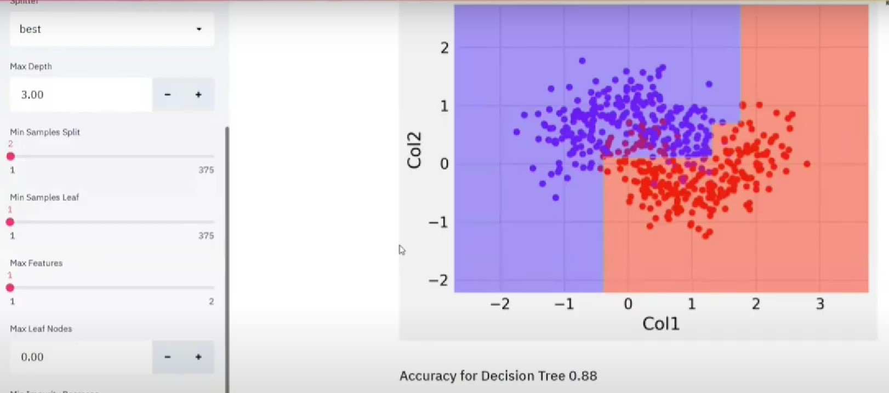

# Comparing ML Algorithm

The project involves developing a data visualization and comparison tool using **Streamlit**, **Matplotlib**, **Ploty**, **Pyplot** library to assess the performance of various Machine Learning algorithms. This project is designed for data scientists, machine learning practitioners, and anyone interested in evaluating and comparing the effectiveness of different ML algorithms.

**Dataset:** iris \
**Algorithms:** kNN, Decision tree, Logistic Regression


## Screenshots




## Installation

Install libraries
```bash
import streamlit as st
import pandas as pd
import numpy as np
import time
import matplotlib.pyplot as plt
from mpl_toolkits.mplot3d import Axes3D
import plotly.express as px
import seaborn as sns
from sklearn.model_selection import train_test_split
from sklearn.metrics import accuracy_score, confusion_matrix, hamming_loss
from sklearn.preprocessing import LabelEncoder
# ML Model----------
from sklearn.neighbors import KNeighborsClassifier
from sklearn.linear_model import LogisticRegression
from sklearn.tree import DecisionTreeClassifier
from sklearn import tree
```
    